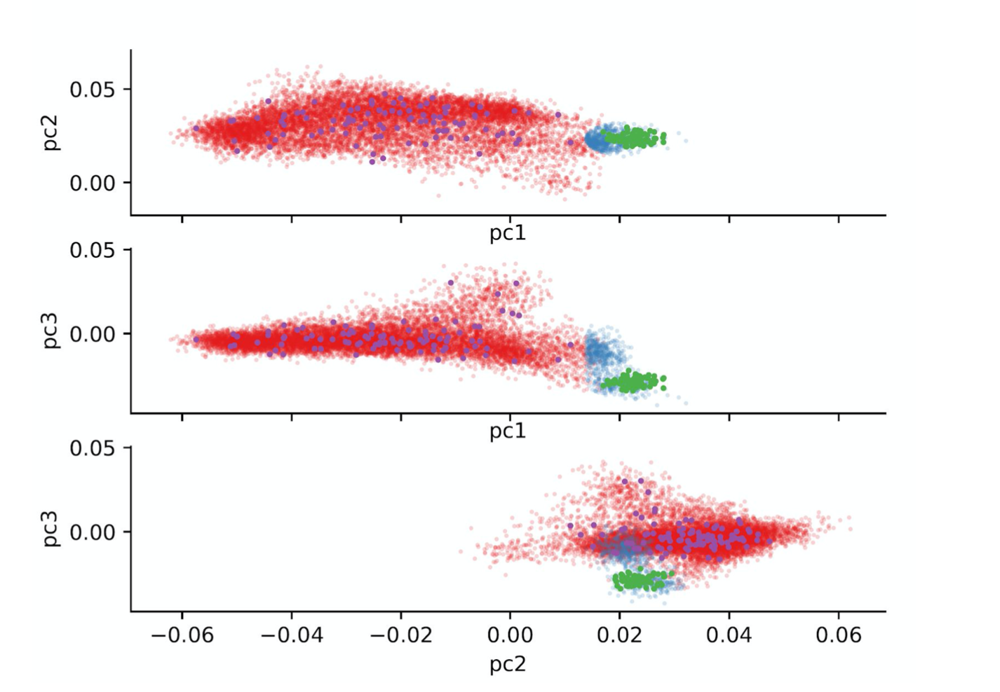

# Quality control

This is a description of the quality control procedures applied before running the GWAS. 

In summary, we removed 4,095 samples who were either of non-Finnish ancestry or twins/duplicates. Finnish ancestry was assessed with a combination of PCA and a Bayesian method for outlier detection. ~~Related or duplicate samples were detected using~~ [~~kinship analysi~~](quality-checks.md)~~s.~~

## Sample QC

Our data set initially consists of 102,739 samples, of which we kept 100,355 after removing duplicates. Next, we proceeded to exclude samples of non-Finnish ancestry using a PCA approach. 

### PCA

After filtering for high quality HQ variants \(36,073 variants\) we merged the data set with the [thousand genomes data](https://www.internationalgenome.org/) \(EUR individuals only\). At this point we performed a PCA on the merged data set and used a Bayesian approach to determine outliers \(see below\). This process allowed us to identify samples from outside the Central/Northern European region \(1,023 samples\). Western European and British samples are still present, but are not enough to drive a signal in the PCA. Thus we used a different approach; we ran a PCA on the 99,333 samples left and we projected the 98 Finnish \(FIN\) and 89 non-Finnish European \(EUR\) samples from the thousand genomes project who survived round one onto the same space. Then, for each Finngen sample, we calculate its Mahalanobis distance to the FIN and EUR centroid. The distance is mapped to a probability with a $$\chi^2 $$distribution with 3 degrees of freedom. Then, we define as being Finns, those sample for whom the relative probability of being Finnish vs European is &gt; 95%. This left us with 98,644 samples.

## Further info 

### Bayesian outlier detection

Code for the method can be found here:​[ github.com/FINNGEN/pca\_outlier\_detection](https://github.com/FINNGEN/pca_outlier_detection). 

Documentation from the original developers of the algorithm can be found here: [http://www.well.ox.ac.uk/~spencer/Aberrant/aberrant-manual.pdf](http://www.well.ox.ac.uk/~spencer/Aberrant/aberrant-manual.pdf). 

### Centroid based outlier detection

The figure below shows how the centroid based outlier detection works by plotting the distribution of the first 3 components of the PCA. We can see that the FinnGen samples labelled as Western European \(in blue\) are extremely close to the Western European centroid in the first two components.

Purple and green dots represent samples of Finnish and Western European \(EUR\) respectively from the thousand genome data set. The blue dots are FinnGen samples who have been found to be more likely to belong to the EUR group rather than to the Finnish one. Dots in red on the other hand are labelled as belonging to the Finnish centroid.

