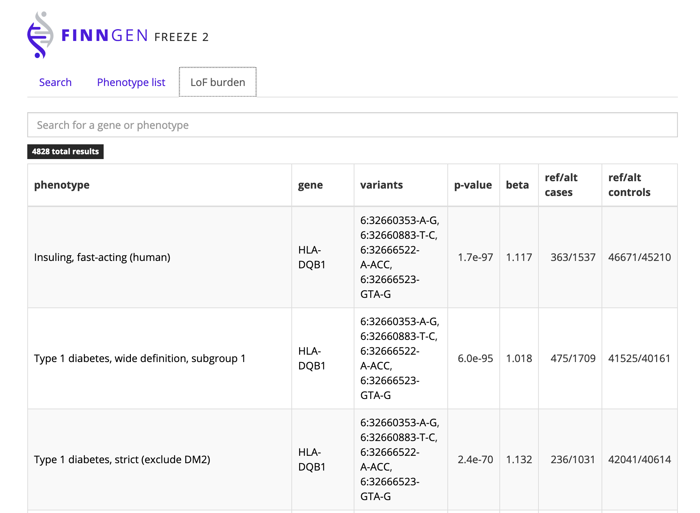

# Gene view / LoF burden

**Clicking on any gene** will bring you to the **gene view** with association results for that gene region, the loss-of-function analysis results \(for methods see [LoF burden](../methods/lof-burden.md)\) and an annotated list of all loss of function and missense variants. 

### LoF burden results

| Column | Description |
| :--- | :--- |
| **p-value beta** | P-value and beta from [association test](../methods/phewas/logistic-regression.md#association-tests). |
| **variants** | All LoF variants within that gene. |

