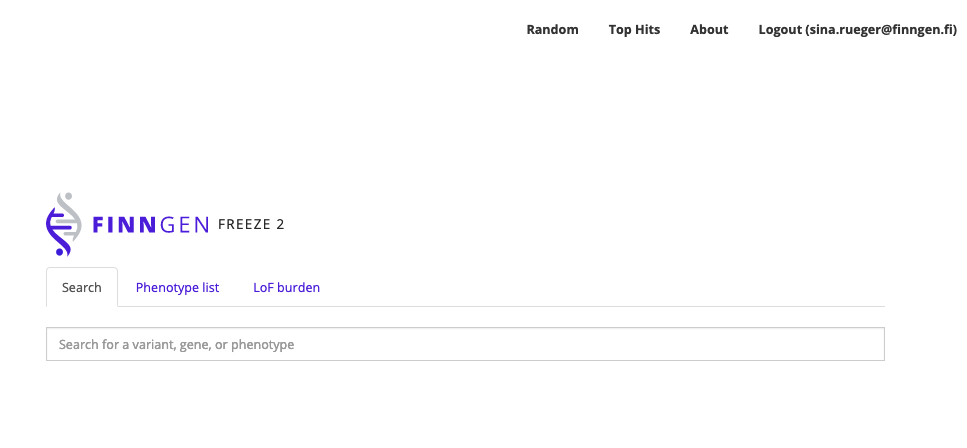

# Get started

[http://r2.finngen.fi/](http://r2.finngen.fi/) will provide you three options

* Search for a particular [variant](variant-view.md), [phenotype](manhattanplot.md) or [gene](gene-view.md). 
* Explore the LoF burden. 
* Check all the phenotypes / endpoints.



