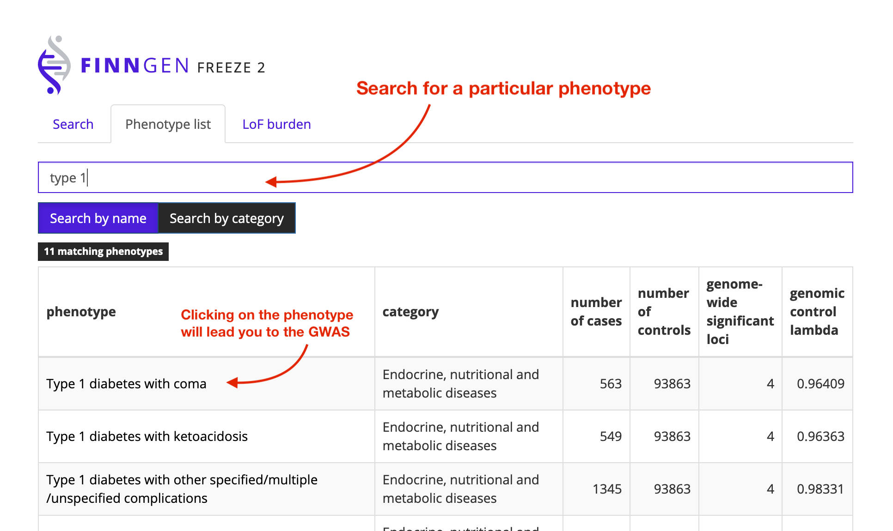

# Phenotype list

Contains all endpoints/ phenotypes for which a GWAS was run \(if more than 100 cases\). 

* **Phenotypes** are composed of ICD-10 codes.  
* 13 phenotype **categories**
* **Genome-wide significant loci:** variant\(s\) with $$P \leq 5 \cdot 10^{-8}$$ within a +/- 500kb window. 

