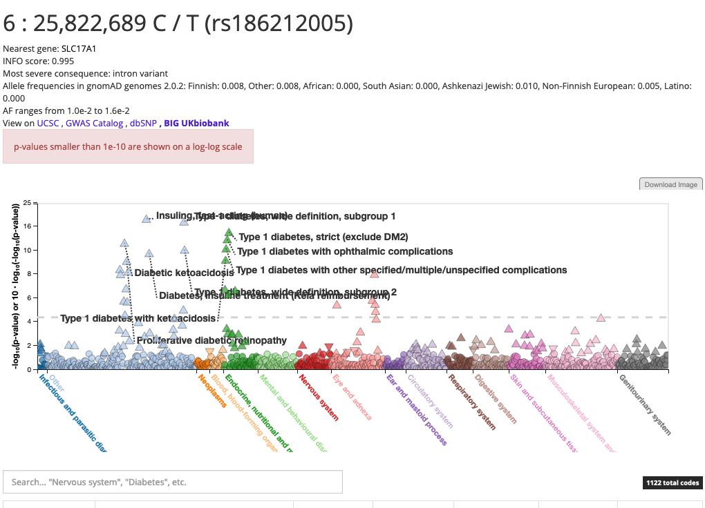

# Variant view

The variant view has the following URL: `http://r2.finngen.fi/variant/CHR-POS-ALT-REF, e.g.` [`http://results.finngen.fi/variant/13-80757865-T-TA`](http://results.finngen.fi/variant/13-80757865-T-TA)\`\`

* `CHR`: chromosome on hg38 \(1-22, X or 23\)
* `POS`: position on hg38
* `REF`: reference allele
* `ALT`: alternative allele

